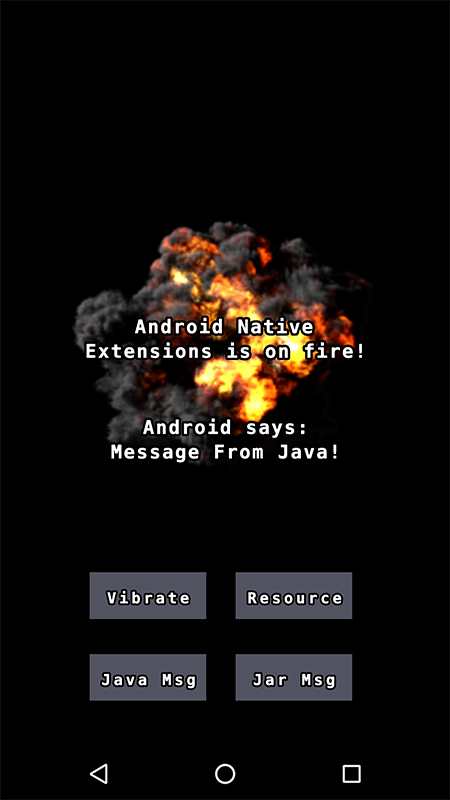

# Android Extension

This is a small example of how to implement native extensions for Android

It features .java files, .jar files, resources, and native function calls (vibration)

## Resources

If you put the resources under `myext/res/android/res` they will be picked up as regular Android resources, and
as such, they need to conform to the naming [standards of Android resources](https://developer.android.com/guide/topics/resources/providing-resources.html)

## JNI

To be able to communicate between C++ and Java, you use [JNI Calls](https://en.wikipedia.org/wiki/Java_Native_Interface). Some resources:

* [JNI Tips](https://developer.android.com/training/articles/perf-jni.html)

* [JNI Hello World](https://developer.android.com/ndk/samples/sample_hellojni.html)

## Build .jar Files

We've added a small example of how to build a .jar file from .java source.
Simply open a command prompt and go to the `java_src` folder, and run the `build.sh` file.
It requires `javac` which you'll get when you install the [Java SE Development Kit](http://www.oracle.com/technetwork/java/javase/downloads/jdk8-downloads-2133151.html)

Note that we use the flags `-source 1.6 -target 1.6` due to the fact that we support many older Android devices.

## Build .a Files

To show you how to create a C++ library file on your own, we've added a small example for this.
Simply open a command prompt and go to the `java_src` folder, and run the `build.sh` file.
It requires that you have installed an Android SDK and NDK.

    NOTE: You may have to alter your "lib_src/build.sh" script with the appropriate paths to your local android tools
